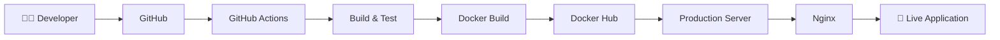

<div align="center">


</div>

<h1 align="center">
  
</h1>

<p align="center">
  <a href="https://github.com/yashwardhan0007">
    
  </a>
  <a href="https://www.linkedin.com/">
    
  </a>
</p>

<p align="center">
  
</p>

---

## 👨‍💻 About Me

I'm a **DevOps Engineer** focused on building, deploying, and maintaining reliable production infrastructure.

- ☁️ Working with **AWS, Linux & Cloud Infrastructure**
- 🐳 Building and managing **Dockerized production environments**
- 🔄 Designing **CI/CD pipelines with GitHub Actions**
- ☸️ Working with **Kubernetes & container orchestration**
- 🏗️ Automating infrastructure using **Terraform & Bash**
- 🌐 Configuring **Nginx, Reverse Proxy & SSL/TLS**
- 📡 Working with **event-driven systems using NATS JetStream**
- 🗄️ Managing **MongoDB, PostgreSQL & Redis**
- 🔐 Handling production configuration, networking and deployment issues
- 🚀 Focused on **automation, reliability, scalability and observability**

> **"Automate what can be automated. Monitor what matters. Build infrastructure that scales."**

---

## 🛠️ DevOps & Cloud Stack

### ☁️ Cloud & Infrastructure

<p>
  
  
  
  
  
  
</p>

### 🐳 Containers & Orchestration

<p>
  
  
  
  
</p>

### 🔄 CI/CD & Automation

<p>
  
  
  
  
  
</p>

### 🌐 Networking & Web Infrastructure

<p>
  
  
  
  
  
</p>

### 🗄️ Databases & Messaging

<p>
  
  
  
  
</p>

### 🐧 OS & Development Tools

<p>
  
  
  
  
</p>

---

## 🚀 What I Work On

```text
┌─────────────────────────────────────────────────────────────┐
│                    DEVOPS WORKFLOW                          │
├─────────────────────────────────────────────────────────────┤
│                                                             │
│  Code → Git → CI → Docker → Registry → CD → Server        │
│                                      ↓                      │
│                              Nginx / SSL / DNS              │
│                                      ↓                      │
│                         Production Services                 │
│                                      ↓                      │
│                    Logs / Monitoring / Backup               │
│                                                             │
└─────────────────────────────────────────────────────────────┘
```

### 🔧 Infrastructure

- AWS EC2 infrastructure
- Linux server administration
- Dockerized application environments
- Production server configuration
- Nginx reverse proxy
- SSL/TLS with Certbot
- DNS and domain configuration
- Server resource and disk management

### 🚀 CI/CD

- GitHub Actions
- Automated Docker image builds
- Docker Hub image publishing
- SSH-based deployments
- Environment-based deployments
- Automated application restarts
- Production deployment troubleshooting

### ☸️ Containers & Kubernetes

- Docker
- Docker Compose
- Kubernetes fundamentals
- Minikube
- Container networking
- Volumes and persistent storage
- Container health and restart policies
- Multi-service application deployments

### 🏗️ Infrastructure as Code

- Terraform
- Bash automation
- Ansible
- Automated server provisioning
- Reproducible infrastructure

---

## 📦 Featured DevOps Projects

| Project | What I Worked On | Technologies |
|---|---|---|
| 🚀 **Production CI/CD** | Automated build, push & deployment pipeline | GitHub Actions • Docker • Docker Hub • SSH |
| ☁️ **AWS Infrastructure** | Cloud servers, storage & production deployments | AWS • EC2 • S3 • EBS |
| 🐳 **Microservices Platform** | Multi-container application infrastructure | Docker • Compose • Nginx • NATS |
| 🌐 **Reverse Proxy Infrastructure** | Domain routing and SSL automation | Nginx • Certbot • DNS |
| 🗄️ **Database Backup System** | Automated database backups and cloud storage | MongoDB • Bash • S3 |
| ☸️ **Kubernetes Lab** | Container orchestration and deployments | Kubernetes • Minikube • Docker |

---

## 🔄 CI/CD Pipeline



---

## 🏗️ Infrastructure Philosophy

```yaml
principles:
  automation:
    - automate_repetitive_tasks

  reliability:
    - predictable_deployments
    - health_checks
    - backups

  security:
    - least_privilege
    - ssl_tls
    - secure_secrets

  scalability:
    - containerization
    - modular_services
    - cloud_infrastructure

  observability:
    - centralized_logs
    - monitoring
    - production_debugging
```

---

## 📊 GitHub Analytics

<p align="center">
  
  
</p>

<p align="center">
  
</p>

---

## 🎯 Currently Learning

```text
☸️  Kubernetes
☁️  AWS Cloud Architecture
🏗️  Terraform & Infrastructure as Code
🔐  DevSecOps
📊  Monitoring & Observability
⚡  Scalable Cloud Infrastructure
```

---

## 🌍 Let's Connect

<p align="center">

<a href="https://github.com/yashwardhan0007">
  
</a>

<a href="https://www.linkedin.com/">
  
</a>

</p>

---

<div align="center">

### ⚡ Build. Automate. Deploy. Scale.

**DevOps • Cloud Infrastructure • CI/CD • Docker • Kubernetes • AWS**

<br/>


</div>
